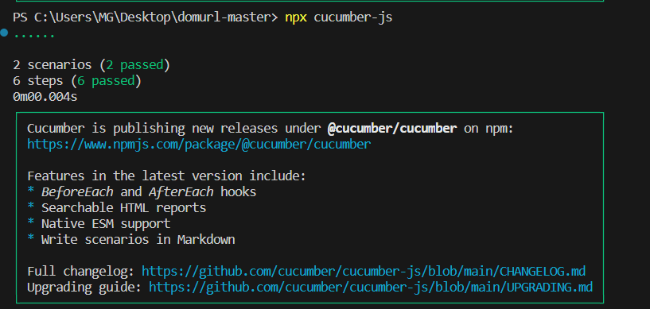

URL Utility Library
The URL Utility Library provides functionality to work with URLs, including parsing query strings, configuring URL properties, and removing query parameters.

Installation
use this command :
npm install --save-dev @cucumber/cucumber

How to Use

Import the necessary modules and dependencies:
const Url = require("url-utility-library");
Use the library's methods within your Cucumber step definitions:

for every scenario , it should take a url so it can check the feature in it
Given an url "https://webshop.com/Products/List?SortDirection=dsc&Sort=price&Page=3&Page2=3&SortOrder=dsc"

first scenario:
Count Query Parameters
This scenario counts the number of query parameters in a given URL and compares it to the expected count.

When count the query parameters
Then the url query number should be "5"
QueryString Parsing
This scenario parses the query string of a given URL and verifies that the individual query parameters are correctly extracted.

second scenario :
Given an url "https://webshop.com/Products/List?SortDirection=dsc&Sort=price&Page=3&Page2=3&SortOrder=dsc"
When I parse the query string
Then the query parameters should be correctly parsed
Remove Query
This scenario removes the query parameters from a given URL and checks if the resulting URL matches the expected value.

third scenario:
Given an url "https://webshop.com/Products/List?SortDirection=dsc&Sort=price&Page=3&Page2=3&SortOrder=dsc"
When remove the query
Then the url should be "https://webshop.com/Products/List"
URL Configuration
This scenario configures the URL properties of a given URL and verifies that the properties are set correctly.

and fourth scenario:
Given an url "https://webshop.com/Products/List?SortDirection=dsc&Sort=price&Page=3&Page2=3&SortOrder=dsc"
When I configure the URL
Then the URL properties should be set correctly

and here is an image of how it worked :

